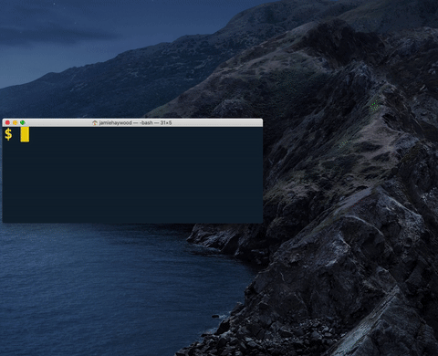

# agor - *(/ˈaɡɔr/)*
>  pronounced *ah-gore* - named after the Welsh for **to open**



A Node CLI utility to launch an iOS simulator and navigate Safari to a specified page. Useful for running manual progressive web app checks on iOS.
## Install
Install globally (recommended)
```sh
yarn global add agor

npm i -g agor
```

## Usage
```sh
agor -a https://google.com -d "iPhone 7"
```

If you want to run this alongside a start script for an application (i.e. Create React App), you'll need to run scripts in parallel. It's recommended you use [`concurrently`](https://github.com/kimmobrunfeldt/concurrently) and add a separate script to your `package.json`:


```json
{
    "scripts":{
        "start":"react-scripts start",
        "start:ios": "concurrently \"yarn start\" \"agor -a http://localhost:3000\""
    }
}
```
## API
The command supports the **`-a`** flag (address) and the **`-d`** flag (device). If no **`-d`**  arg is provided, the default device will be an `iPhone 12`

The exact syntax of supported devices can be found by running `xcrun simctl list` in the terminal and copying the device name only (excluding UUID etc.)


## Prerequisites
- Latest XCode installed.
- Install the XCode CLTs - `xcode-select --install`


## Notes
By default the simulator will not run devices older than an iPhone 6S (< iOS 13).